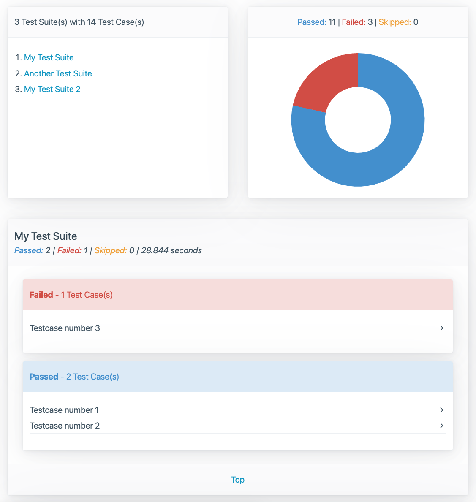

# Sandboy Surefire Reporting

_Clear and concise Surefire reporting!_


<!-- START doctoc generated TOC please keep comment here to allow auto update -->
<!-- DON'T EDIT THIS SECTION, INSTEAD RE-RUN doctoc TO UPDATE -->

- [Maven usage](#maven-usage)
    - [Plugin dependency](#plugin-dependency)
    - [Report generation](#report-generation)
        - [surefireSourcePath](#surefiresourcepath)
        - [generatedReportPath](#generatedreportpath)
- [Sample Report](#sample-report)

<!-- END doctoc generated TOC please keep comment here to allow auto update -->

Sandboy is a very clear and concise alternative report generator for Surefire XML files. These are generated
by [Maven Surefire](https://maven.apache.org/surefire/maven-surefire-plugin/)
and [Maven Failsafe](https://maven.apache.org/surefire/maven-failsafe-plugin/) when running unit or integration tests.

Usually, these reports are generated by the [Maven Site Plugin](https://maven.apache.org/plugins/maven-site-plugin/) but
the resulting reports are usually ugly and not very clear.

This project was inspired by my [Cluecumber reporting project for Cucumber JSON](https://github.com/trivago/cluecumber).

## Maven usage

For now, Sandboy comes as a Maven plugin. In the future, it might also be implemented as a CLI utility or other flavors.

### Plugin dependency

You can add this plugin dependency to your Maven project's build section like so:

```xml

<build>
    <plugins>
        <plugin>
            <groupId>blog.softwaretester</groupId>
            <artifactId>sandboy-maven</artifactId>
            <version>${project.version}</version>
            <executions>
                <execution>
                    <id>Generate_Report</id>
                    <phase>none</phase>
                    <goals>
                        <goal>report</goal>
                    </goals>
                </execution>
            </executions>
            <configuration>
                <surefireSourcePath>${project.basedir}/surefire/real.xml</surefireSourcePath>
                <generatedReportPath>${project.build.directory}/sandboy-report</generatedReportPath>
            </configuration>
        </plugin>
    </plugins>
</build>
```

### Report generation

Report generation can be triggered by `mvn sandboy:report`.

__Note:__ It is important not to call `mvn clean sandboy:report` if the Surefire XML files are inside the `target`
directory - otherwise these would be wiped by the `clean` command!

You only need to provide two parameters (as seen in the `<configuration>` section above): `surefireSourcePath`
and `generatedReportPath`.

#### surefireSourcePath

This parameter specifies the location of the Surefire XML files. It can be a directory or the path to one specific
Surefire XML file.

In case of a directory, Sandboy will only process Surefire XML files and skip all others.

#### generatedReportPath

This is the path to store the generated report in.

## Sample Report


